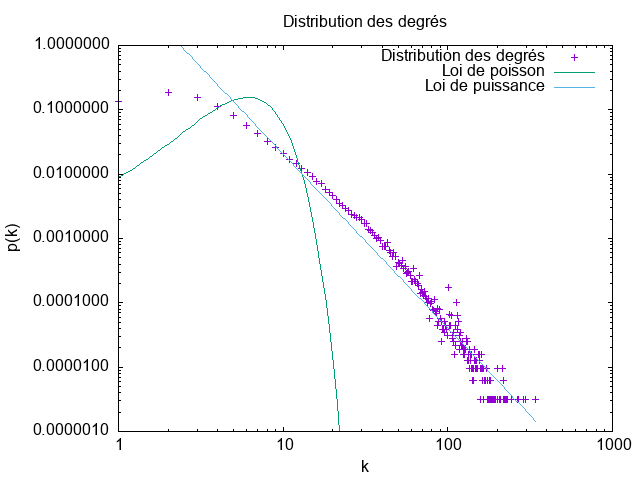
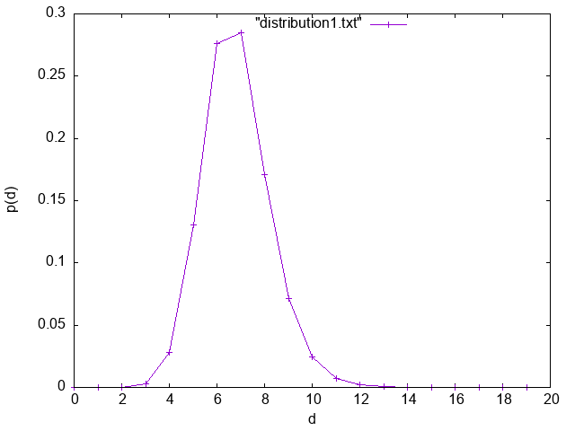

# Reseaux d interaction

Nous allons analyser un réseau de collaboration scientifique en informatique.  Le réseau est extrait de DBLP et disponible sur SNAP.

## **1. Lecture des données**

pour commencer nous allons télécharger dans un premier temps le fichier qui contient des données depuis  [FileSourceEdge](https://data.graphstream-project.org/api/gs-core/current/org/graphstream/stream/file/FileSourceEdge.html).  ensuite nous allons lire les données à l'aide de la fonction  `readAll()`  qui se trouve dans  _graphStream_  après avoir instancier un  `FileSourceEdge()`.

## **2. mesures de base**

```
public class Main {  
public static void main(String[] args) {  
    String filePath = "data/com-dblp.ungraph.txt";  
    Graph graph = new DefaultGraph("graph");  
    FileSourceEdge fs = new FileSourceEdge();  
    fs.addSink(graph);  
    try {  
        // Read the graph from the file  
		  fs.readAll(filePath);  

    } catch (IOException ioException) {  
        ioException.printStackTrace();  
    } finally {  
        fs.removeSink(graph);  
    }  
    System.out.println("Nombre de noeuds : " + graph.getNodeCount());  
    System.out.println("Nombre d'arcs : " + graph.getEdgeCount());  
    System.out.println("Degree moyen : " + Toolkit.averageDegree(graph));  
    System.out.println("coefficient de clustering : " + Toolkit.averageClusteringCoefficient(graph));  
    }  
}

```

-   nombre de nœuds : 317080
-   nombre de liens : 1049866
-   degré moyen : 6.62208890914917
-   coefficient de clustering : 0.6324308280637396

La probabilité p est définie comme p=$`\frac {⟨k⟩}{N}`$  ⟨k⟩  est le degré moyen et N est le nombre de nœuds.

En effet,  le coefficient de clustering moyen dans un graphe aléatoire G(N,p)  est la moyenne des coefficients de clustering de tous les nœuds ayant un degré supérieur ou égal à 2.

Dans notre cas,  la moyenne du coefficient de clustering pour un réseau aléatoire de la même taille et du même degré moyen p=$`\frac {⟨k⟩}{N}`$  est calculée comme suit  :

$`C_{aléatoire} <=> p = \frac{⟨k⟩}{N} <=> \frac{6.62208890914917}{317080} \approx 2.0884 × 10 ^ {-5}`$

## **3. connexité**

1. Un réseau connexe est défini comme un ensemble de nœuds interconnectés, où chaque nœud est relié à au moins un autre nœud du réseau. Pour évaluer la connectivité de notre graphe, nous utilisons une fonction de GraphStream qui retourne `true` si le graphe est connexe, sinon `false`. En appliquant cette fonction avec `Toolkit.isConnected(notre graphe)`, elle renvoie `true` ce qui indique que notre graphe forme un réseau connexe.


2. si le degré moyen du graphe aléatoire `Toolkit.averageDegree(graph)` est supérieur au logarithme  du nombre de nœuds `Math.log(graph.getNodeCount()`, alors le graphe a de fortes chances d'être connexe. En d'autres termes, un nombre de connexions suffisamment élevé entre les nœuds, représenté par un degré moyen plus grand, favorise la connectivité du graphe.
   dans notre cas pour un réseau aléatoire de même taille et de même degré moyen on a  :

|degré moyen| ln(nbNœuds) |
|--|--|
| **6.62208890914917** | **12.666909386951092** |

d'apres ce tableau on peut deduire que le graphe aléatoire de même taille et de même degré moyen n'est pas connexe.

3. Pour garantir la connectivité de ce graphe, il est nécessaire d'avoir un degré moyen d'au moins 12,66.


## **4. la distribution des degrés**

La distribution des degrés dans un graphe décrit comment les degrés des nœuds (nombre d'arêtes connectées à chaque nœud) sont répartis. Elle peut suivre une distribution de Poisson, où la plupart des nœuds ont des degrés similaires, ou une distribution de puissance, avec quelques nœuds fortement connectés. On peut calculer cette distribution en utilisant la fonction `Toolkit.degreeDistribution(graph)` du **GraphStream**.
pour cela nos allons utiliser la fonction suivante :

    public void generateDegreeDistribution() {  
        int numberOfNodes = graph.getNodeCount();  
        int[] degreeDistribution = Toolkit.degreeDistribution(graph);  
      
        try {  
            PrintWriter file = new PrintWriter(new FileWriter("src/data/distribution.txt"));  
      
            for (int i = 0; i < degreeDistribution.length; i++) {  
                // Écriture dans le fichier avec la probabilité normalisée  
      file.write(i + "   " + (double) degreeDistribution[i] / numberOfNodes);  
                file.println();  
            }  
            file.close();  
        } catch (Exception e) {  
            e.printStackTrace();  
        }  
    }

Cette fonction `generateDegreeDistribution` prend un graphe en entrée, calcule la distribution des degrés des nœuds de ce graphe en utilisant la fonction `Toolkit.degreeDistribution(graph)`, puis enregistre cette distribution dans un fichier texte appelé `"distribution.txt".` Chaque ligne du fichier contient un degré de nœud et la probabilité normalisée associée à ce degré dans le graphe.

- *échelle linéaire* :


 ***- échelle log-log :***


 **- Est-ce qu'on observe une ligne droite en log-log ? Que cela nous indique ?**

En représentant graphiquement la distribution des degrés sur une échelle logarithmique-logarithmique, on constate l'émergence d'une ligne droite sur plusieurs décades. Ce phénomène suggère la présence d'une loi de puissance de la forme $`P_k = C \cdot k^{-\gamma}`$, où $`P_k`$ est la probabilité d'un degré $`k`$ donné, $`C`$ est une constante, et $`\gamma`$ est l'exposant de la loi de puissance.

 - ***distribution de Poisson :***
	 

- **Coefficients de la loi de puissance**
 
 	gamma = 2.70539  et  +/- 0.04437      (1.64%)

## 5. **la distance moyenne dans le réseau**

 - **Est-ce qu'il s'agit d'un réseau petit monde ?**

pour verifier qu'il s'agit d'un reseau petit monde , Il faut que $`d_{max}`$ soit égale à la distance moyenne obtenue précédemment.
 $`d_{max} = \frac{ln(N)}{ln(<k>)} = 6.700`$
d'apres ce resultat on peut deduire qu'il s'agit d'un petit monde.

 
  - **Quelle sera la distance moyenne dans un réseau aléatoire avec les
   mêmes caractéristiques ?**

-   nombre de nœuds : 317080
-   degré moyen : 6.62208890914917

 $`d_{max} = \frac{ln(N)}{ln(k)} = \frac{ln(317080)}{ln(6.62208890914917)} = 6.70061181886`$

- La distribution des distances :
- 

D'après le graphe précédent, on peut déduire que la distribution des distances suit une loi binomiale.

**

## 6. Graphe aleatoire et graphe de Barabasi ##

à l'aide des deux méthodes genererGrapheAleatoire(int nombreNoeuds, int degreMoyen) et  genererGrapheBarabasi(int nombreNoeuds, int degreMoyen)
nous allons pouvoir créer les deux graphes afin de comparer entre eux :

- **Graphe aléatoire :**
- Nombre de nœuds dans le graphe aléatoire : 100008 
- Nombre d'arêtes dans le graphe aléatoire : 349654
- Degré moyen dans le graphe aléatoire : 6.992521
- Coefficient moyen de regroupement dans le graphe aléatoire : 1.1903604275617001E-4
- Le graphe est connexe : false
- Degré moyen pour un graphe connexe de même taille : 11.5130054617704


- **Graphe de Barabasi :**

- Nombre de nœuds dans le graphe Barabasi : 100002
- Nombre d'arêtes dans le graphe Barabasi : 398995
- Degré moyen dans le graphe Barabasi : 7.979741
- Coefficient moyen de regroupement dans le graphe Barabasi : 0.0011614788009815422
- Le graphe est connexe : true
- Degré moyen pour un graphe connexe de même taille : 11.512945464770231


D'après ces résultats, on remarque que le coefficient moyen de regroupement dans 
le graphe de Barabasi est plus élevé par rapport à celui du graphe aléatoire. 
La connexité du graphe de Barabasi suggère une structure plus intégrée,
tandis que le graphe aléatoire peut contenir des composants isolés.ire peut contenir des composants isolés. 


**

## TP-2 Propagation dans des réseaux

**

### 1. 1 )

le seuil épidémique dans un réseau peut être estimé à l'aide du seuil épidémique de base (λ​), qui représente le nombre moyen d'infections résultant d'un individu infecté introduit dans une population totalement susceptible. Pour un réseau aléatoire, λ​ est lié au degré moyen (k) par la formule λ=β/γ, où β est le taux de contact et γ est le taux de guérison.

Taux de contact (β): Comme chaque individu envoie un e-mail par semaine à chaque collaborateur, le nombre moyen de contacts par jour c peut être défini comme c=1/7.

Taux de guérison (γ): Comme chaque individu met à jour son antivirus tous les deux semaines, le taux de guérison (γ) peut être défini comme 1/14.

Maintenant, le seuil épidémique de base (λ​) peut être calculé comme λ​=β/γ. Substituant les valeurs, nous avons:

λ= $\frac {1/7}{1/14}$ = 2 .

1.2)

Le seuil épidémique du réseau (λc​) est déterminé par la relation λc​=$\frac {k}{k^2}$​, où k est le degré moyen et $k^2$ est la dispersion des degrés dans le réseau.

1.3) a l'aide de la methode  `Toolkit.degreeDistribution()` qui retourn un tableau de Int nous allons cree une methode `dispersionDegre()` qui utilise la formule suivante pour calculer la dispersion des degrés    $K^2 = \sum(i^2 * \frac{nombre de nœuds avec degreˊ i}{NombreTotaleDeNoeuds})$.

- degre moyen dblp : 6.62208890914917
- degre moyen du graphe aleatoire: 6.672928810119629
- dispersion des degrés du graphealeatoire:63.02328370140902
- dispersion des degrés du graphe dblp : 144.00627601867035
- λc du graphe aleatoire : 0.10588037338286836
- λc du graphe dblp : 0.045984724362225844


Il est clair que le seuil épidémique dans un réseau de degré moyen similaire est plus élevé dans le cas d'un réseau aléatoire.

### 2.Simulez la propagation du virus

- scénario 1 :
  
  on remarque dans le premier scénario que le nombre des infectés atteint c'est maximum vu  qu'on ne fait rien pour arrêter la propagation du virus dans le reseau.
  pour ce faire , nous avons cree la foctions `scenario1()` .
  cette fonction simule la propagation d'un virus dans un réseau au cours de 90 jours. La simulation débute avec un patient initial infecté. Chaque jour, le virus est transmis aux voisins infectés avec une probabilité de 1/7. Les nouveaux individus infectés sont ajoutés à la liste des malades.
  Le nombre total d'infections est mis à jour chaque jour, et les résultats sont affichés, notamment le nombre de nouveaux infectés et le total d'infectés pour chaque jour. Enfin, les résultats sont sauvegardés dans un fichier texte ("src/scenarios/sc1.txt") pour une analyse ultérieure.
- scénario 2 :
  
  Dans le deuxième scénario, nous avons mis en place une simulation visant à persuader 50 % de la population de mettre régulièrement à jour leur programme, avec une fréquence de deux fois par mois, soit tous les 14 jours en utilisant la fonction `immuniserAleatoire()`

- scénario 3 :
  
  En fin, dans le 3eme scénario, nous avons mis en place une simulation visant à persuader 50 % de la population de convaincre un de leur collaborateurs de mettre régulièrement à jour leur programme, avec une fréquence de deux fois par mois, soit tous les 14 jours en utilisant la fonction `immuniserSelective()` .
  on remarque dans ce scénario que le nombre des infections reste à peu près nulle.